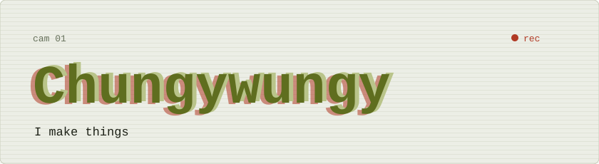
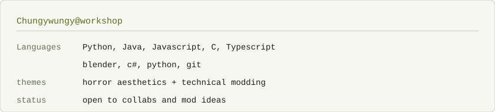
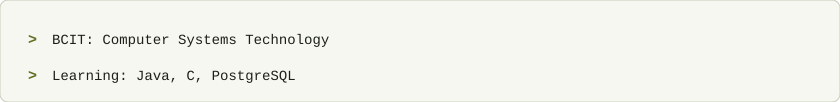
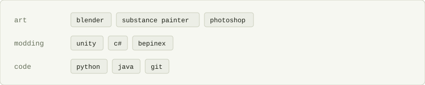
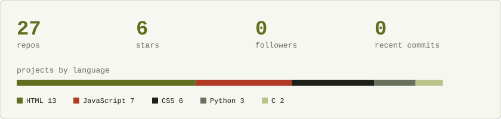
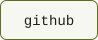
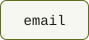
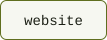

<picture>
  <source media="(prefers-color-scheme: dark)" srcset="assets/hero-dark.svg">
  
</picture>

<picture>
  <source media="(prefers-color-scheme: dark)" srcset="assets/bar-about-dark.svg">
  
</picture>
<picture>
  <source media="(prefers-color-scheme: dark)" srcset="assets/profile-dark.svg">
  
</picture>

<picture>
  <source media="(prefers-color-scheme: dark)" srcset="assets/bar-now-dark.svg">
  
</picture>
<picture>
  <source media="(prefers-color-scheme: dark)" srcset="assets/now-dark.svg">
  
</picture>

<picture>
  <source media="(prefers-color-scheme: dark)" srcset="assets/bar-stack-dark.svg">
  
</picture>
<picture>
  <source media="(prefers-color-scheme: dark)" srcset="assets/stack-dark.svg">
  
</picture>

<picture>
  <source media="(prefers-color-scheme: dark)" srcset="assets/bar-activity-dark.svg">
  
</picture>
<picture>
  <source media="(prefers-color-scheme: dark)" srcset="assets/activity-dark.svg">
  
</picture>

<picture>
  <source media="(prefers-color-scheme: dark)" srcset="assets/bar-reach-dark.svg">
  
</picture>
<a href="https://github.com/Chungywungy"><picture>  <source media="(prefers-color-scheme: dark)" srcset="assets/btn-github-dark.svg">  </picture></a><a href="fshariff3@my.bcit.ca"><picture>  <source media="(prefers-color-scheme: dark)" srcset="assets/btn-email-dark.svg">  </picture></a><a href="https://example.com"><picture>  <source media="(prefers-color-scheme: dark)" srcset="assets/btn-website-dark.svg">  </picture></a>
